# Mono — UI/UX 기획서

본 문서는 Mono Control의 화면 구조·시각 체계·설치/배포 UX를 정의한다.  
참고: 원본 「프로그램 기획 및 기능 구체화 명세서」, Roon 화면(아래 임베드), 기능 정의는 [`01-기획명세서.md`](01-기획명세서.md).

**제품 결정 (확정): 사용자는 브라우저·터미널 없이 네이티브 `.exe`만으로 실행·관리한다.**  
`wwwroot` 웹 UI와 콘솔창(`OutputType=Exe`)은 개발용 프로토타입이며, 출시 UX가 아니다.

---

## 1. 목적과 원칙

| 원칙 | 설명 |
| --- | --- |
| **exe-only** | 일반 사용 경로에 브라우저·CMD/PowerShell 창·`.bat` 더블클릭을 두지 않는다. 창은 GUI만. |
| 음질 ↔ 소셜 분리 | 채팅·핀·반응은 컨트롤 채널만 사용. 오디오 콜백·MATP와 UI 스레드를 섞지 않는다. |
| Control은 소리 없음 | **Mono.Control.exe**(Avalonia GUI)는 명령·시각화만. 소리는 **Mono.Output.exe**가 DAC로 낸다. |
| Core는 백그라운드 | **Mono.Core.exe**는 헤드리스(`WinExe` / 트레이). Control이 없으면 자동 기동, 콘솔 없음. |
| Roon IA → Mono 재해석 | Roon의 Core/Remote/Output 감성을 Mono의 **Core / Control / Output** 3단에 맞춘다. |
| 신뢰 UI | Bit-perfect 여부, SRC, 싱크 오프셋, 출력 장치를 상시 노출한다. |
| 목표 IA | Avalonia Control = Roon형(좌 사이드바 + 본문 + 하단 바). 웹 3열 UI는 레거시. |

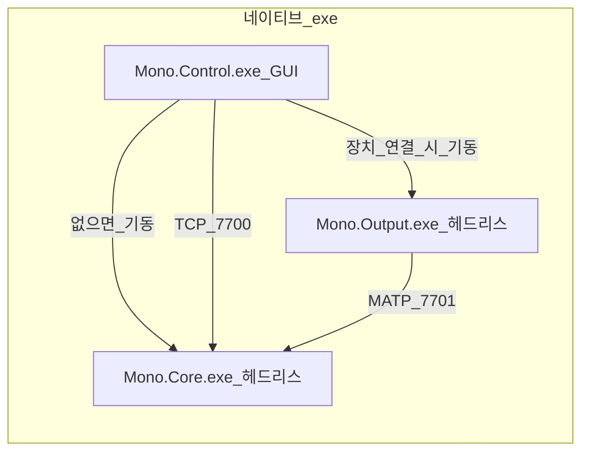
```mermaid
flowchart LR
  subgraph apps [네이티브_exe]
    Ctrl[Mono.Control.exe_GUI]
    CoreExe[Mono.Core.exe_헤드리스]
    OutExe[Mono.Output.exe_헤드리스]
  end
  Ctrl -->|"없으면_기동"| CoreExe
  Ctrl -->|"장치_연결_시_기동"| OutExe
  Ctrl -->|TCP_7700| CoreExe
  OutExe -->|MATP_7701| CoreExe
```

---

## 2. 비주얼 시스템

### 2.1 컬러 토큰

| 토큰 | 라이트 | 다크 | 용도 |
| --- | --- | --- | --- |
| Main | `#FFFFFF` | `#121317` | 기본 배경 |
| Panel | `#F7F7FA` | `#1A1C22` | 사이드바·패널 |
| Point | `#6D6DF6` | `#8F8FF8` | CTA·활성·시크 채움 (Roon 포인트 계열) |
| Text | `#1A1A1E` | `#F2F2F5` | 본문 |
| Muted | `#6B6F7A` | `#9AA0AB` | 보조 설명 |
| Line | `#E6E7EC` | `#2B2E36` | 구분선·카드 테두리 |
| Warn | `#D9762F` | `#E39A5C` | 경고·핀 마커 |
| Bad | `#C44` / `#E88` | 오류·포맷 불가 |

라이트/다크는 OS 테마 연동 + Control 설정에서 수동 토글.

### 2.2 타이포그래피

| 역할 | 폰트 | 비고 |
| --- | --- | --- |
| 브랜드 / 페이지 타이틀 | Fraunces (세리프) | Roon의 큰 세리프 헤더 대응 |
| UI·본문·메타 | Inter | Avalonia에 임베드 또는 시스템 폴백 |
| 경로·기술 메타 | ui-monospace | 설정·About만 (온보딩에 터미널 명령 노출 금지) |

### 2.3 공통 컴포넌트

| 컴포넌트 | 스펙 |
| --- | --- |
| 버튼 | pill. ghost(아웃라인) 기본, primary만 Point 채움 |
| 카드 | radius 12px, 얇은 Line, 호버 시 약한 elevation |
| 앨범 그리드 | 정사각 아트 + 제목/아티스트. 소스 배지(Local / Tidal / Qobuz / Local+Stream) |
| 하단 플레이어 바 | 전역 고정. 아트 · 메타 · 트랜스포트 · 시크(+히트맵) · 존/장치 · 볼륨 · 시그널 패스 |
| 시크바 | 얇은 트랙 + Point 채움 + 핀 마커 + 반응 히트맵 레이어 |
| 배지 | Bit-perfect / SRC / Max·HiFi / sync offset·jitter |
| 모달·패널 | `--panel2` 톤으로 위계. 온보딩은 중앙 카드 오버레이 |

---

## 3. 정보 구조 (목표 IA)

**Mono.Control.exe (Avalonia)** 는 Roon과 같은 **좌 사이드바 + 본문 + 하단 바**를 쓴다. 라운지·라이너는 **우측 드로어/오버레이**.

레거시 `wwwroot` 3열 웹 UI는 프로토타입 참고용이며 출시 경로가 아니다.
### 3.1 사이드바 매핑 (Roon → Mono)

| Roon | Mono | 비고 |
| --- | --- | --- |
| Home | Home | 추천·최근·HI-RES 장르 진입 |
| Genres | Genres | 로컬+스트리밍 병합 장르 |
| Qobuz / TIDAL | Qobuz / Tidal | 파트너 허브 (데모→SDK) |
| History | History | 청음·세션 히스토리 |
| *(없음)* | **라운지** | Open/Invite/Host Queue/Audiophile |
| Albums / Artists / Tracks | 동일 | 병합 카탈로그 |
| Composers / Compositions | 동일 | 메타데이터 그래프 |
| Folders | Folders | 스캔 루트별 |
| Playlists | Playlists | ♥ / 세션 / 스마트 / 믹스 |

현재 레거시 웹 UI의 3열은 **참고용 프로토타입**일 뿐, Avalonia 구현은 위 목표 IA를 따른다.

### 3.2 하단 바 (항상 노출)

1. 좌: 미니 아트 · 곡명 · 아티스트 · ♥  
2. 중: prev / play / next · 시크(+히트맵) · 큐 토글  
3. 우: 시그널 패스(품질) · **출력 존/장치** · 볼륨 · 라운지 칩

하단 아트/타이틀 클릭 → Now Playing 몰입 모드.

---

## 4. 화면별 스펙 (Roon 참고 이미지)

이미지 경로: [`docs/assets/roon-ui/`](assets/roon-ui/).  
아래 화면은 모두 **Mono.Control.exe (Avalonia)** 에서 렌더링한다.

### 4.1 온보딩

#### Welcome

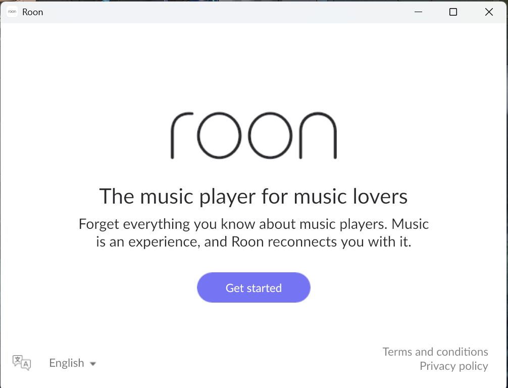

- **Roon**: 중앙 로고·태그라인·Get started, 하단 언어.  
- **Mono**: `mono` 워드마크 + *"혼자서도, 같이서도 하나의 소리로."* → **시작하기**. 언어는 설정으로 미룸(1차 한국어 UI).

#### 스트리밍 연동

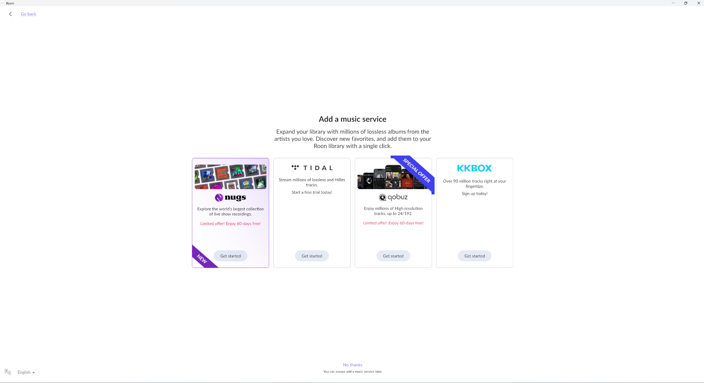

- **Roon**: 서비스 카드 그리드 + Get started / No thanks.  
- **Mono** step 4: Tidal / Qobuz 카드(또는 ghost 버튼). 건너뛰기 허용. 토큰은 Core만 보관.

#### 오디오 장치 Enable

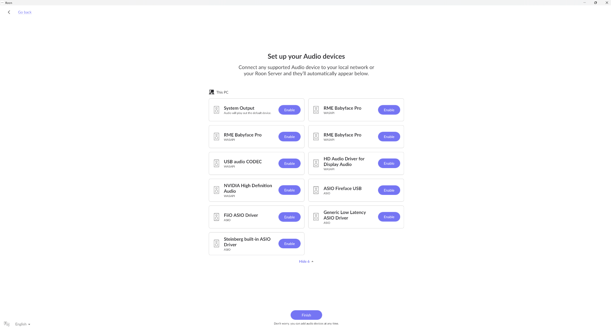

- **Roon**: This PC 아래 WASAPI/ASIO 카드 + Enable → Zone.  
- **Mono** step 3: Output이 광고한 엔드포인트 리스트 + **존 만들기**. 장치 없으면 Control이 **「이 PC에 출력 연결」** 버튼으로 `Mono.Output.exe`를 백그라운드 기동(콘솔 없음). 터미널 명령어를 사용자에게 보여 주지 않는다.  
  Windows: ASIO/WASAPI Exclusive · Mac: Exclusive — Bit-perfect 가능함을 한 줄로 명시.

#### Mono 온보딩 6단계 (현재 구현과 목표 동일)

| Step | 화면 | 필수 |
| --- | --- | --- |
| 0 | Welcome | ○ |
| 1 | 표시 이름 | ○ |
| 2 | 라이브러리 경로·스캔 | 건너뛰기 가능 |
| 3 | 출력 장치·존 | 건너뛰기 가능 |
| 4 | Tidal/Qobuz | 건너뛰기 가능 |
| 5 | 완료 → 호스트/기기 탭에서 재조정 안내 | ○ |

헤더 **가이드**로 재실행. `localStorage` 등으로 완료 플래그.

---

### 4.2 Home / 탐색

#### Home · Discover

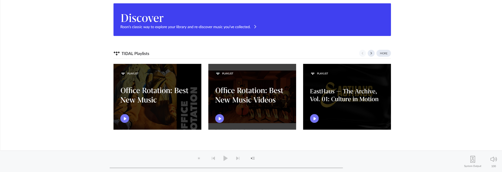

- **Roon**: Discover 배너 + 스트리밍 플레이리스트 가로 스크롤 + 하단 바.  
- **Mono**: 최근 재생 · 라운지 재입장 · **HI-RES 장르** 진입 · 스마트/믹스 플레이리스트 가로 섹션. 섹션마다 MORE.

#### Genres

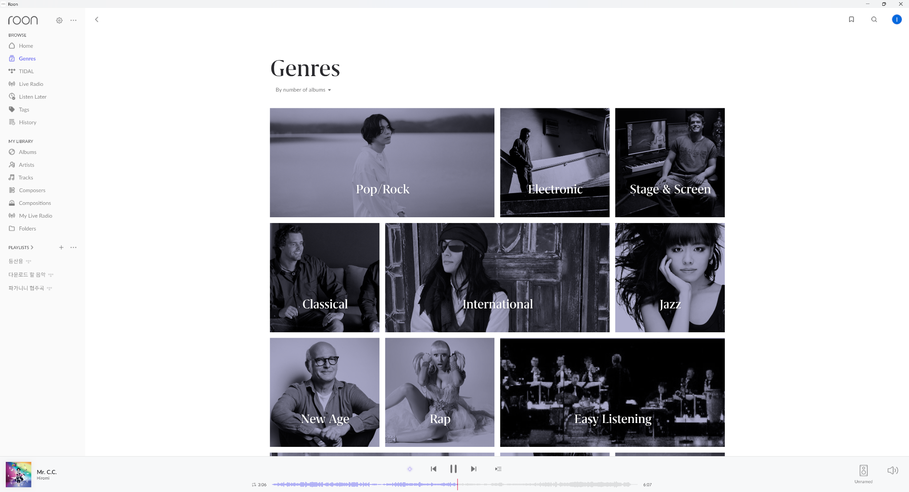

- **Roon**: 이미지 타일 그리드, 세리프 타이틀.  
- **Mono**: 메타 기반 장르 타일. 정렬(앨범 수/이름). 타일 탭 → 앨범 그리드 필터.

#### 스트리밍 허브 (Qobuz 예시)

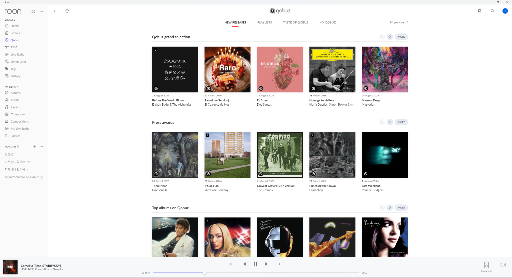

- **Roon**: NEW RELEASES 등 탭 + 가로 앨범 레일.  
- **Mono**: 동일 IA. 로그인 방식은 파트너 정책(Tidal OAuth 웹 / Qobuz ID·PW 등)을 존중. 미연동 시 연동 CTA만.

---

### 4.3 내 라이브러리

#### My Albums

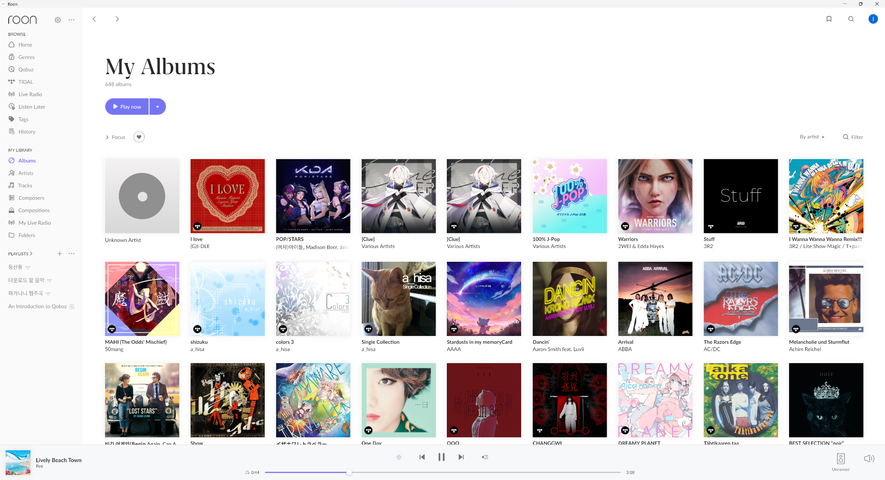

- **Roon**: 세리프 타이틀 · Play now · Focus · 정렬 · 고밀도 아트 그리드 · 소스 아이콘.  
- **Mono**: 로컬+스트리밍 병합. 배지 `Local` / `Stream` / `Local+Stream`. 목표 스크롤 60fps(아트 캐시는 Core).

#### My Composers

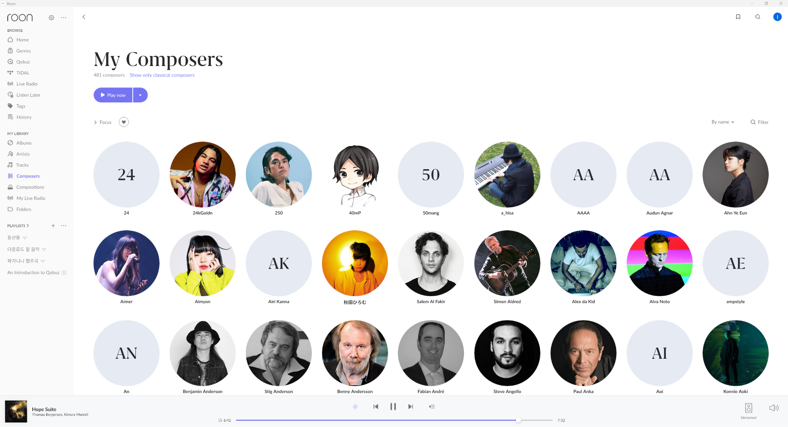

- 원형 아바타 그리드. 사진 없으면 이니셜 플레이스홀더.  
- Mono: 그래프의 Composer 노드와 동일 데이터.

#### My Compositions

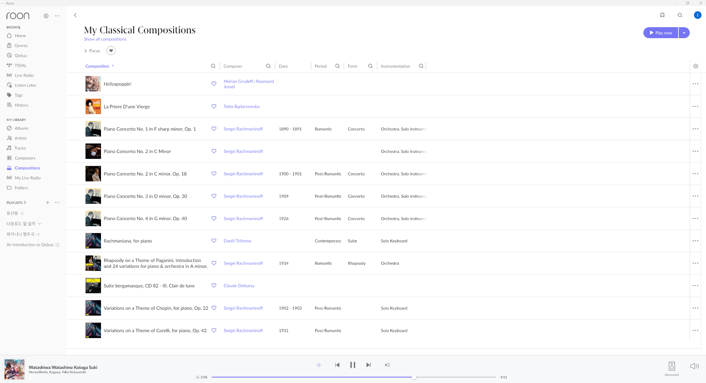

- 테이블: 작품명 · 작곡가(링크) · 시대 · 형식 · 편성.  
- 같은 작품의 여러 연주/커버를 묶어 비교 청취.

#### Playlists

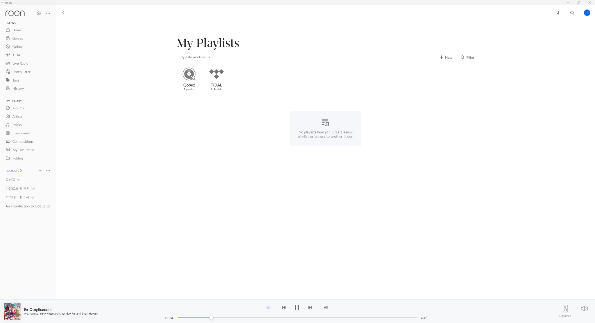

- **Mono 자동 생성 3종**: (1) ♥·반응 곡 (2) 세션 아카이브 동의 후 (3) 좋아요 5곡↑ 스마트 추천.  
- **믹스 플레이리스트**: 청음 이력 기반, 로컬+스트리밍 혼합. 빈 상태 카피 유지.

---

### 4.4 Now Playing (몰입)

#### 앨범 아트 모드

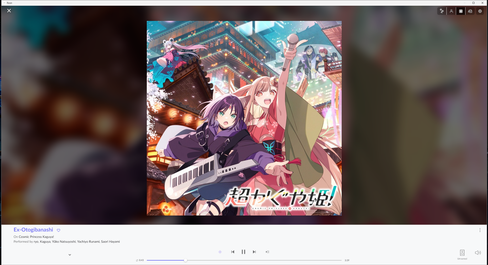

#### 아티스트 모드

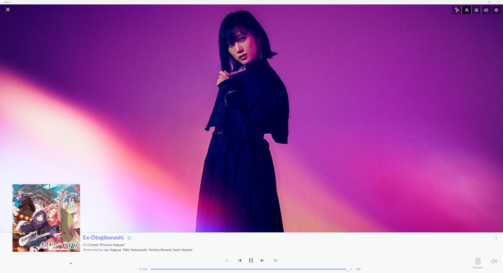

#### 가사 모드

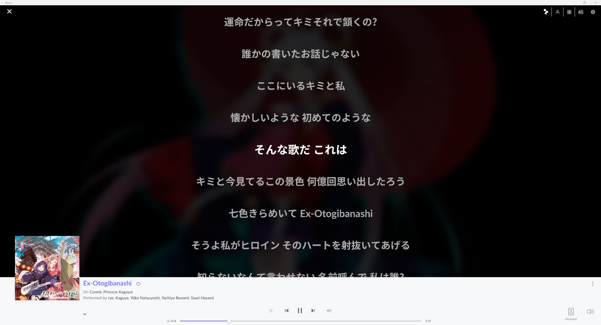

공통:

- 블러 아트 배경 + 하단 흰 컨트롤 바.  
- 우상단 모드 전환: 가사 · 아티스트 · 앨범 · **연혁(위키)** · **Track Credits**.  
- 가사는 `media_time` 동기 하이라이트(룸 전원 동일).  
- Mono 추가: 시크 위 **반응 히트맵**, 이모지 ❤️🎉👏🔥 (곡당 유저당 3회), 타임스탬프 핀, 종료 40초 전 **스마트 오토플레이** 3후보 카드.

---

### 4.5 DSP / MUSE 대응 (시그널 패스)

#### Convolution · 필터 체인

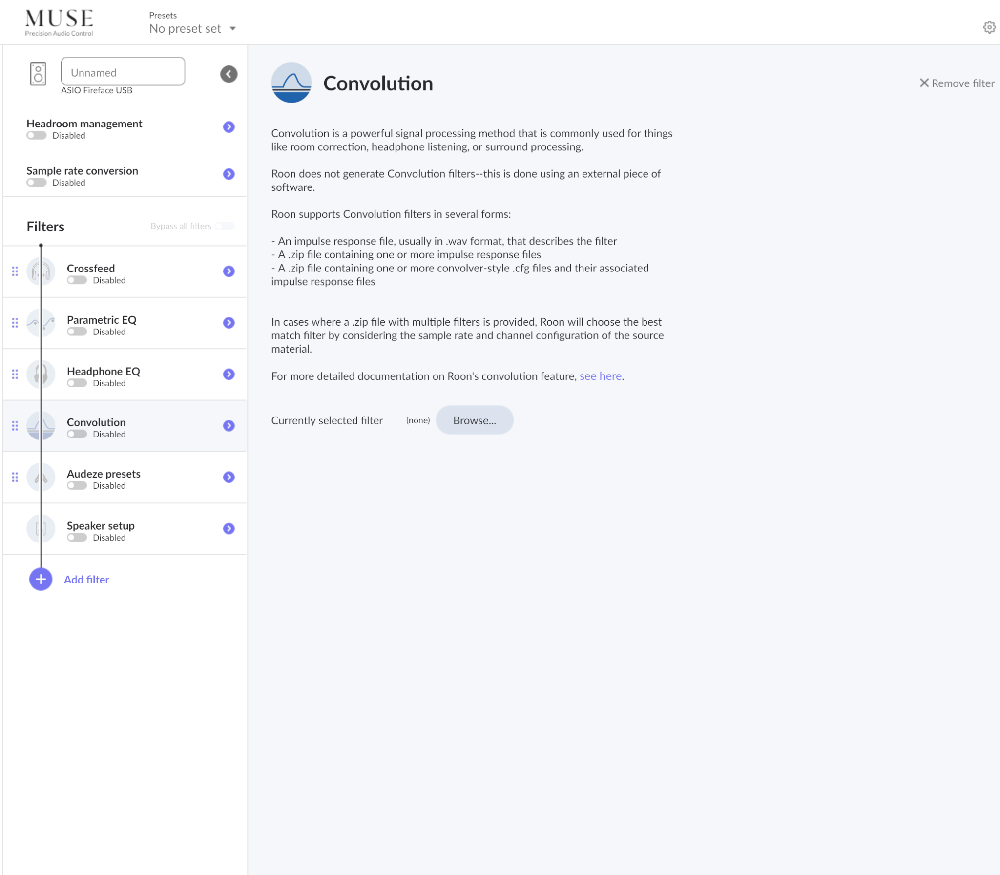

#### Headphone EQ · Device EQ 방향

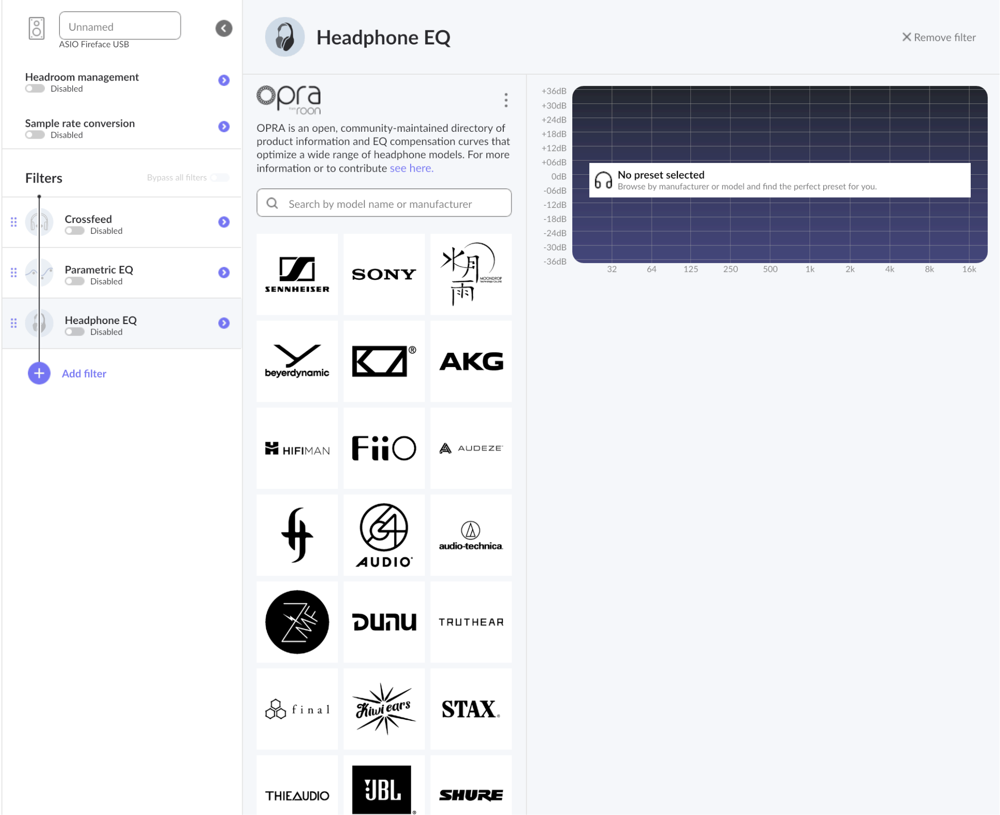

| Roon MUSE | Mono | 단계 |
| --- | --- | --- |
| Headroom | DSP 체인 전단 헤드룸 | P1 |
| Sample rate conversion | `DspPipeline` 업샘플 | 일부 ✅ |
| Crossfeed | 프리셋 Crossfeed | ✅ 프리셋 / UI 고도화 P1 |
| Parametric EQ | **Easy EQ** — Parametric 기본 + Graphic 쉬운 모드 → Parametric 전환 | P1 |
| Headphone EQ / Device EQ | 장비별 커브 검색·적용 (검수 후 업로드) | P2 로드맵 |
| Convolution | IR WAV/ZIP, REW 연동·쉬운 룸 보정 | P2 |
| Speaker setup | 거리·레벨·딜레이 보정 UI (수치+가이드) | P2 |

Audiophile 모드: DSP Off 고정, UI는 아트/라이너 중심, 채팅 접힘.

시그널 패스 아이콘 탭 → 현재 경로(소스 → DSP → 장치 · Bit-perfect 여부)를 투명하게 표시.

---

### 4.6 라운지 (Mono 전용 · Roon에 없음)

| 요소 | UX |
| --- | --- |
| 생성 | 이름 + 모드(Open / Invite / Host Queue / Audiophile) |
| 참여 | 룸 ID + 초대 코드. 포맷 협상 실패 시 사유 명시 |
| 큐 | 공동 편집 또는 Request→승인. 잠금 가능 |
| 소셜 | 채팅 · 핀 · 반응. Audiophile 기본 접힘 |
| Follow Host | 라이너/페이지 단위 호스트 뷰 추종 |
| 종료 | “이번 라운지를 저장할까요?” → 아카이브/휘발 |

목표 레이아웃에서는 우측 드로어 또는 사이드바 **라운지** 항목.

---

### 4.7 설정

#### Storage

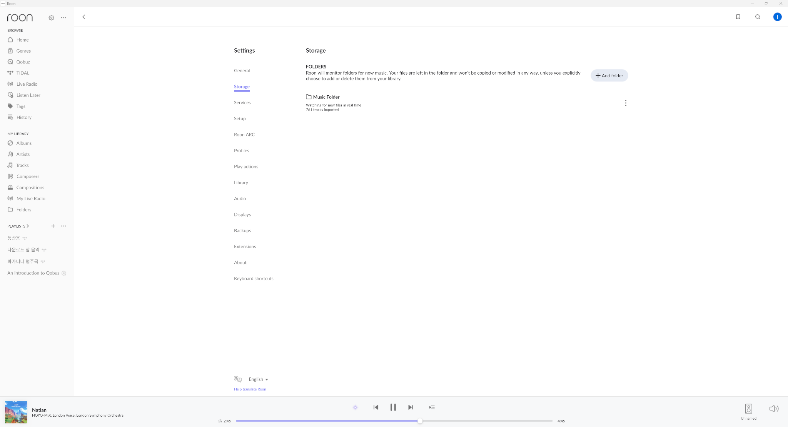

- 폴더 추가/제거, 감시·스캔 상태, 트랙 수. 원본 파일 수정하지 않음을 명시.

#### Play actions · Shortcuts

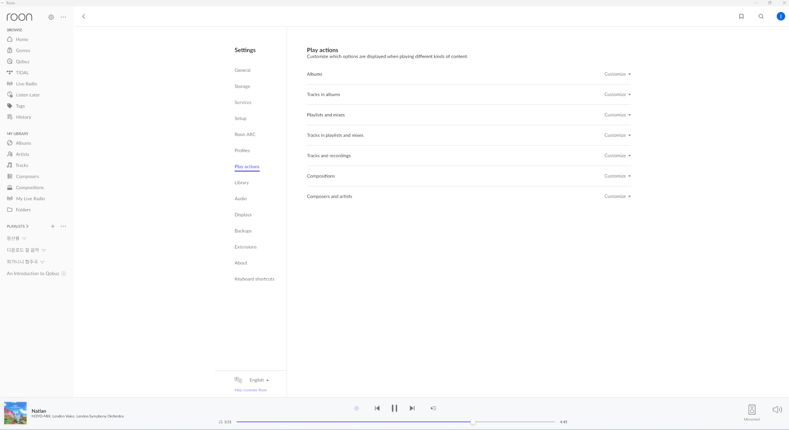

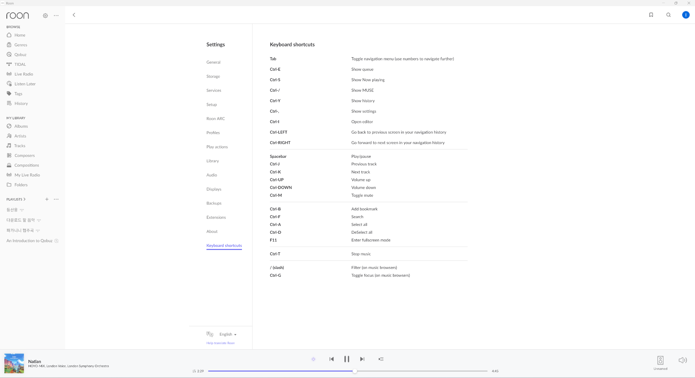

#### Mono 설정 트리 (축소)

| 메뉴 | 내용 |
| --- | --- |
| General | Core 주소·포트, 표시 이름, 테마 |
| Storage | 라이브러리 루트·스캔 주기 |
| Services | Tidal/Qobuz 연동 |
| Audio | 엔드포인트·존·Exclusive 정책 |
| Library | 병합·정렬·별칭(다국어 검색) |
| Lounge | 기본 룸 모드·보존·동의 |
| DSP | Easy EQ·Crossfeed·IR·Speaker Setup |
| Backups | catalog/history DB 백업(음원 파일 제외) |
| About | 버전 · 포트 · 라이선스 고지 |
| Shortcuts | 재생/검색/Now Playing 단축키 |

---

## 5. `.exe` 전용 배포 · 설치 UX (브라우저·터미널 금지)

### 5.0 확정 규칙

| 금지 | 대체 |
| --- | --- |
| 브라우저로 Control 열기 (`:7702` 웹페이지) | **Avalonia `Mono.Control.exe` GUI** |
| 검은 콘솔/터미널 창 | 세 exe 모두 **`OutputType=WinExe`** (Windows). 로그는 파일·트레이·About |
| 사용자용 `.bat` / `dotnet run` 안내 | 바로가기 = **Control.exe** 하나. Core·Output은 Control이 자식 프로세스로 기동 |
| 온보딩에 터미널 명령 노출 | 「이 PC에 출력 연결」GUI 버튼만 |

개발자 전용: CLI·웹·bat은 저장소에 남을 수 있으나 **출시 패키지·사용법에는 넣지 않는다.**

### 5.1 제품 구성

| 파일 | `OutputType` | 역할 | 사용자 인식 |
| --- | --- | --- | --- |
| **Mono.Control.exe** | WinExe + Avalonia | 유일한 창형 UI. 온보딩·라이브러리·라운지·설정. Core/Output 수명 관리 | “Mono를 연다” (시작 메뉴·바로가기) |
| **Mono.Core.exe** | WinExe (헤드리스) | 카탈로그·룸·MATP·마스터 클럭. 트레이 아이콘(선택) | 보통 안 보임. Control이 기동 |
| **Mono.Output.exe** | WinExe (헤드리스) | DAC 출력·클럭 슬레이브. 트레이(선택) | Control 「출력 연결」로 기동 |

단일 PC 기본: Control 더블클릭 → Core 자동 기동 → GUI. 소리 필요 시 Output 자동/버튼 기동.

### 5.2 사용자 시나리오 (첫 실행)

1. **Mono.Control.exe** 더블클릭 (콘솔·브라우저 없음).  
2. Core가 로컬에 없으면 Control이 같은 폴더의 `Mono.Core.exe`를 백그라운드로 기동하고 `:7700`에 연결.  
3. Avalonia 온보딩 6단계.  
4. 「이 PC에 출력 연결」→ `Mono.Output.exe` 백그라운드 기동 + 룸/개인존 자동 배정.  
5. 창 닫기: 설정에 따라 (A) Control만 종료·Core/Output 유지(트레이) 또는 (B) 관련 프로세스 함께 종료.

복사용 문구(`사용법.txt`):

- Mono.Control.exe만 실행하세요. 검은 창이나 웹 브라우저가 열리면 잘못된 빌드입니다.  
- Control은 소리를 내지 않습니다. 출력은 앱 안에서 연결합니다.  
- .NET 별도 설치 불필요(셀프 Contained).  
- 방화벽 허용: 포트 **7700**(Control↔Core), **7701**(MATP).

### 5.3 배포 폴더 규약

```
dist/
  사용법.txt
  Mono.Control.exe          ← 사용자 진입점 (또는 Mono.Control/ 폴더)
  Mono.Core.exe             ← 동일 디렉터리 또는 Mono.Core/
  Mono.Output.exe
  data/                     ← Core 데이터(첫 실행 시 생성 가능)
```

- `wwwroot/`·`Run-*.bat`·CLI 전용 빌드는 **출시 zip에 포함하지 않음**.  
- 다른 PC로 옮길 때: 위 exe(+data)만 복사.

### 5.4 프로세스·창 동작

| 프로세스 | 창 | 실패 시 |
| --- | --- | --- |
| Control | 메인 윈도우 1개 | 메시지 박스 (Core 기동 실패, 포트 점유 등) |
| Core | 없음. 선택적 트레이 | Control이 재시도·로그 경로 안내 |
| Output | 없음. 선택적 트레이 | Control 「소리 없음」배지 + 재연결 |

Windows: `<OutputType>WinExe</OutputType>`, `PublishSingleFile` + self-contained.  
macOS/Linux: Avalonia 동일, Core/Output은 데몬·에이전트 스타일(콘솔 숨김).

### 5.5 빌드 방법 (문서 스펙)

```powershell
dotnet publish src/Mono.Control -c Release -r win-x64 --self-contained true -p:PublishSingleFile=true -o dist
dotnet publish src/Mono.Core    -c Release -r win-x64 --self-contained true -p:PublishSingleFile=true -o dist
dotnet publish src/Mono.Output  -c Release -r win-x64 --self-contained true -p:PublishSingleFile=true -o dist
```

개발: `dotnet run --project src/Mono.Control` (Avalonia). Core는 Control이 붙이거나 별도 기동.  
레거시 웹(`:7702`)은 디버그 플래그로만 유지 가능 — **기본 OFF, 출시 OFF**.

### 5.6 포트 · 다중 기기

| 포트 | 용도 | 사용자 노출 |
| --- | --- | --- |
| 7700 | Control ↔ Core TCP JSON | About/고급 설정만 |
| 7701 | MATP | About/고급만 |
| ~~7702~~ | (레거시 웹·REST) | **출시 UX에서 제거·비활성** |

원격 Control·타 PC Output: Control 설정에서 Core 호스트·페어링. 웹 URL 안내 없음.

### 5.7 설치 UX 체크리스트

- [ ] Control.exe만으로 시작, **콘솔 창 0개**  
- [ ] 브라우저가 자동으로 열리지 않음  
- [ ] Core/Output 자동 기동·종료 정책이 GUI에 있음  
- [ ] 첫 실행 온보딩(완료 전 메인 차단)  
- [ ] Output 미연결 시 「소리 없음」+ 연결 버튼  
- [ ] 포트 충돌 시 메시지 박스(원인·조치)  
- [ ] SmartScreen: 사용법에 “자세한 정보 → 실행”  
- [ ] 언인스톨 = 폴더 삭제(+ data 백업 안내)

---

## 6. 상태 · 접근성 · 카피

| 상황 | UI |
| --- | --- |
| Bit-perfect | 녹색/Point 배지 `Bit-perfect` |
| SRC·DSP 개입 | `SRC` / 프리셋명 배지 |
| 싱크 | `sync −0.2ms · jitter 0.3ms` (측정값) |
| 포맷 불가 | “이 룸은 DSD256 고정 — 기기가 지원하지 않음” + 참관 옵션 |
| 스트리밍 미구독 | 큐 추가 차단 + 연동 CTA |
| Output 오프라인 | 장치 목록에 Offline · 재생 시 경고 |

키보드: Space 재생/일시정지, `/` 검색 포커스, Esc 몰입/모달 닫기 (Roon Shortcuts 참고).

---

## 7. 현재 → 목표 이행

| 영역 | 현재 (레거시) | 목표 (출시) |
| --- | --- | --- |
| Control 셸 | 브라우저 + Core `:7702` | **Avalonia Mono.Control.exe** |
| Core/Output 창 | 콘솔 Exe | **WinExe 헤드리스** (트레이 선택) |
| 진입점 | bat → 브라우저 | **Control.exe만** |
| 레이아웃 | 웹 3열 | 사이드바 + 본문 + 하단 바 |
| Now Playing | 중앙 컬럼 | 몰입 전체화면 + 모드 전환 |
| 기기 Enable | 웹 리스트 | Roon형 Enable 카드 + Output 자동 기동 |
| DSP | 프리셋 select | MUSE형 필터 체인 + Easy EQ |
| :7702 웹 | 기본 ON | **기본 OFF / 출시 제거** |

---

## 8. 우선순위

| 우선 | 항목 |
| --- | --- |
| **P0** | ~~Avalonia Control 셸 + WinExe Core/Output~~ ✅ 기본 구현. 이어서 실아트·몰입 Now Playing·폴더 피커 |
| **P1** | Now Playing 몰입, Easy EQ UI, 시그널 패스, Home 레일, 트레이 종료 정책 |
| **P2** | Device EQ, Convolution/REW, Speaker Setup, Genres 타일, 레거시 wwwroot 삭제 |

---

## 9. 관련 문서

- 기능·모드: [`01-기획명세서.md`](01-기획명세서.md)  
- 3단 아키텍처·MATP: [`02-아키텍처.md`](02-아키텍처.md)  
- 구현 상태: [`03-구현현황.md`](03-구현현황.md)
